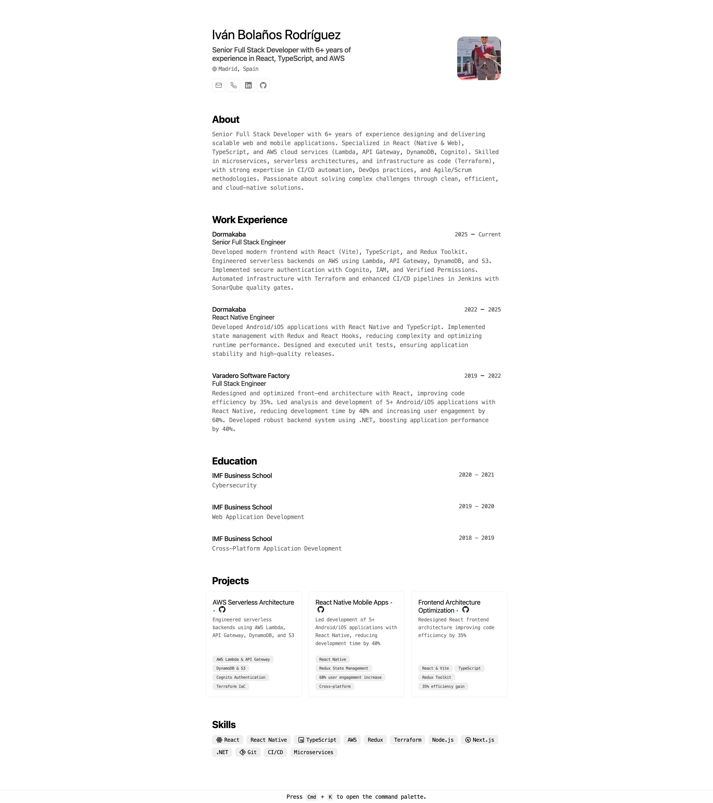

<div align="center">
 
<h2>
    Minimalist <em>Résumé</em> layout for web and pdf
</h2>
<p>
CV JSON Schema from <a href="https://jsonresume.org/schema/">jsonresume.org</a>
</p>


<p>
Based on the design by <a href="https://github.com/BartoszJarocki/cv">Bartosz Jarocki</a>

</p>

</div>

<div align="center">
    <a href="#🚀-getting-started">
        Getting Started
    </a>
    <span>&nbsp;✦&nbsp;</span>
    <a href="#🧞-commands">
        Commands
    </a>
    <span>&nbsp;✦&nbsp;</span>
    <a href="#🔑-license">
        License
    </a>
   
</div>

<p></p>

<div align="center">


</div>

</img>

## 🛠️ Stack

- [**Astro**](https://astro.build/) - The web framework of the new era.
- [**Typescript**](https://www.typescriptlang.org/) - JavaScript with type syntax.
- [**Hotkeypad**](https://github.com/dnl-fm/hotkeypad) - Keyboard shortcuts library for enhanced navigation.


## 🚀 Getting Started

### 1. Clone the repository

```bash
git clone https://github.com/Ivan-Bolanos/minimalist-portfolio-json.git
cd minimalist-portfolio-json
```

- This project uses [pnpm](https://pnpm.io/installation) as package manager.

```bash
# Enable pnpm on MacOS, WSL & Linux:
corepack enable
corepack prepare pnpm@latest --activate

# Install dependencies
pnpm install
```

### 2. Customize your content:
Edit the `cv.json` file with your own information following the [JSON Resume schema](https://jsonresume.org/schema/).

### 3. Launch the development server:

```bash
# Enjoy the result
pnpm dev
```


1. Open [**http://localhost:4321**](http://localhost:4321/) in your browser to see the result 🚀


## 🧞 Commands

|     | Command          | Action                                        |
| :-- | :--------------- | :-------------------------------------------- |
| ⚙️  | `dev` or `start` | Starts local dev server at `localhost:4321`.  |
| ⚙️  | `build`          | Check for errors and build production bundle to `./dist/`.      |
| ⚙️  | `preview`        | Preview your build locally at `localhost:4321` |


## 🔑 License

[MIT](LICENSE.txt) - Created by [**Ivan Bolaños**](https://linkedin.com/in/ivan-bolaños).


